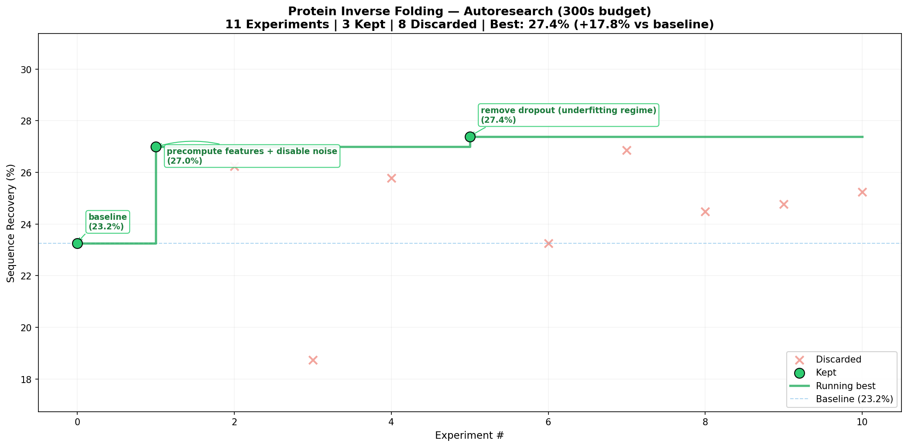
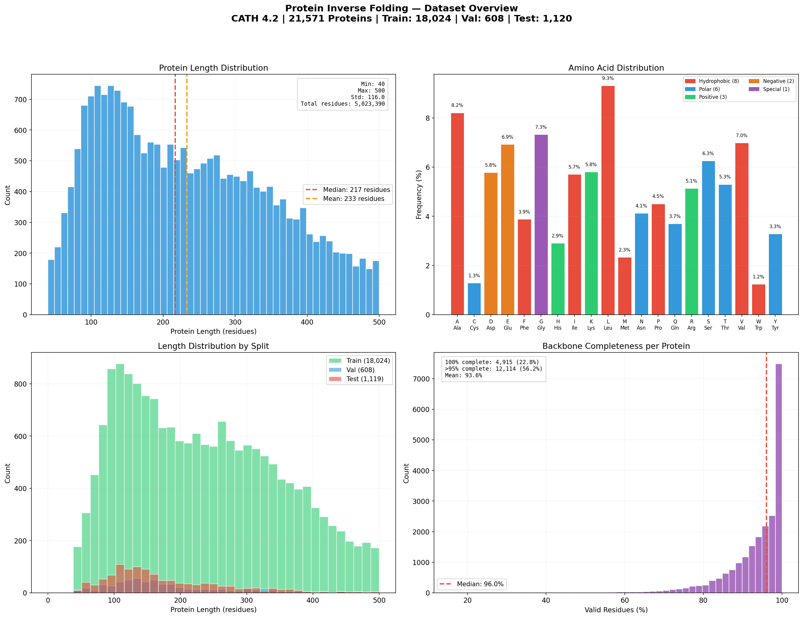
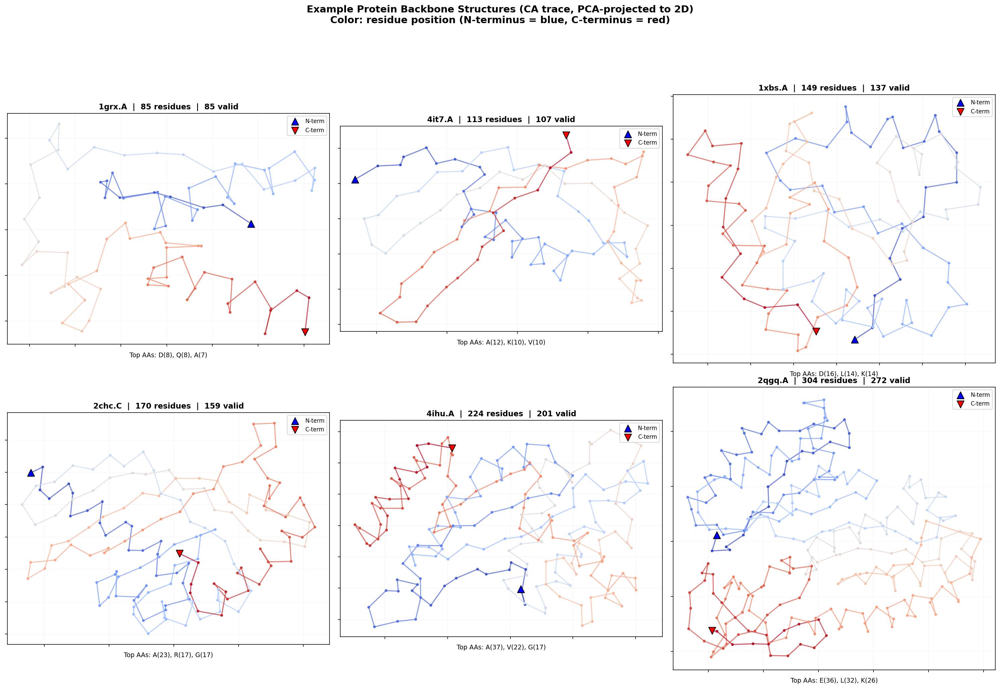
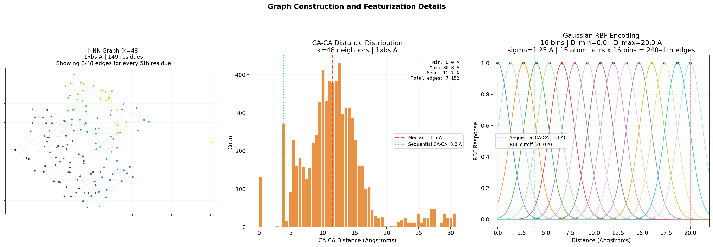
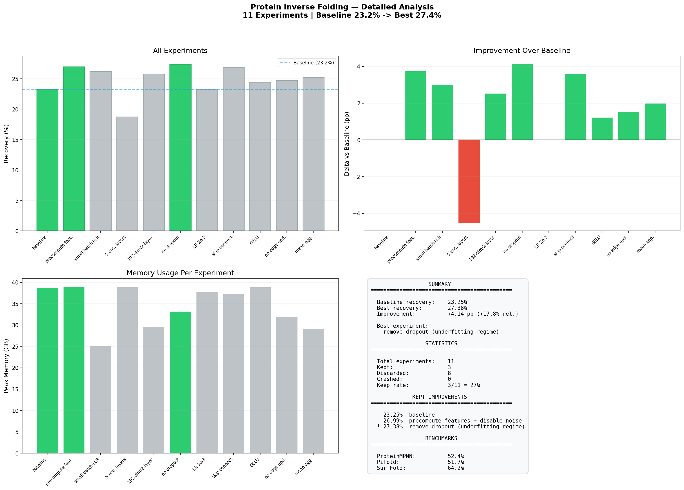

<p align="center">
  
</p>

<h1 align="center">invfold</h1>

<p align="center"><b>Autonomous protein inverse folding research, powered by AI agents.</b></p>



*Give an AI agent a protein design model and let it experiment autonomously. It modifies the code, trains for 5 minutes, checks if recovery improved, keeps or discards, and repeats. You wake up to a log of experiments and a better model.*

Inspired by Karpathy's [autoresearch](https://github.com/karpathy/autoresearch) for LLM pretraining — adapted here for the structural biology problem of protein inverse folding.

---

## Table of Contents

- [What is Protein Inverse Folding?](#what-is-protein-inverse-folding)
- [How Autoresearch Works](#how-autoresearch-works)
- [Quick Start](#quick-start)
- [Setup](#setup)
- [Dataset](#dataset)
- [Project Structure](#project-structure)
- [Running Experiments](#running-experiments)
- [Architecture](#architecture)
- [Results](#results)
- [Customization](#customization)
- [Contributing](#contributing)
- [References](#references)
- [License](#license)

---

## What is Protein Inverse Folding?

Protein inverse folding is the task of designing an amino acid sequence that folds into a desired 3D backbone structure. You are given the spatial coordinates of a protein backbone (N, CA, C, O atoms for each residue) and must predict which of the 20 standard amino acids belongs at each position.

```
Input:  3D backbone coordinates (N, CA, C, O per residue)
Output: Amino acid sequence (20 classes per position)
Metric: Sequence recovery = fraction of correctly predicted amino acids
```

This is the central enabling technology for de novo protein design. Every designed enzyme, therapeutic antibody, biosensor, and novel material starts here. [ProteinMPNN](https://www.science.org/doi/10.1126/science.add2187) made it practical in 2022, and the field has exploded since.

### Why is it perfect for autoresearch?

- **Clean scalar metric.** Sequence recovery (% correct) gives an unambiguous keep/discard signal.
- **Small models.** ProteinMPNN is ~1.7M parameters. Each experiment trains in minutes, not hours.
- **Massive headroom.** ProteinMPNN (52.4%) to SurfFold (64.2%) — 12 percentage points of improvement through architectural innovation alone at the same model scale.
- **Real-world impact.** Any model that beats ProteinMPNN on CATH has immediate utility for protein engineering.

### Competitive landscape

| Method | Year | Type | Recovery (CATH) | Params |
|--------|------|------|-----------------|--------|
| Rosetta | -- | Physics | 32.9% | -- |
| StructGNN | 2019 | Autoregressive | 36.4% | ~2M |
| GVP | 2021 | Autoregressive | 39.2% | ~2M |
| ProteinMPNN | 2022 | Autoregressive | 52.4% | ~1.7M |
| PiFold | 2023 | One-shot | 51.7% | ~6M |
| KW-Design | 2024 | Iterative | 60.5% | ~4.1B |
| SurfFold | 2026 | One-shot | 64.2% | ~10M |

The autoresearch target is the 1-10M parameter regime: beat ProteinMPNN (52.4%) through discovered architectural innovations, without pretrained language models.

---

## How Autoresearch Works

The repo has three files that matter:

| File | Role | Who modifies it |
|------|------|-----------------|
| `prepare.py` | Fixed data pipeline, featurization, evaluation | Nobody (read-only) |
| `train.py` | Model architecture, optimizer, training loop | The AI agent |
| `program.md` | Research strategy, search space, agent rules | The human |

The agent runs an infinite loop:

```
LOOP FOREVER:
  1. Modify train.py with an experimental idea
  2. git commit
  3. Train for 5 minutes: uv run train.py > run.log 2>&1
  4. Extract result: grep "^val_metric:" run.log
  5. If recovery improved → KEEP (advance branch)
     If recovery worse   → DISCARD (git reset --hard HEAD~1)
  6. Log to results.tsv
  7. Repeat
```

Each experiment takes ~5-6 minutes. That's ~12 experiments/hour, ~100 overnight. The human wakes up to a results log and a progressively better model.

---

## Quick Start

```bash
# 1. Install uv (if you don't have it)
curl -LsSf https://astral.sh/uv/install.sh | sh

# 2. Clone and install
git clone https://github.com/mr-siddy/invfold.git
cd invfold
uv sync

# 3. Download data and cache protein structures (~5 min)
uv run prepare.py

# 4. Run a single training experiment (~5 min)
uv run train.py
```

If all four commands succeed, your setup is working. You can now start autonomous research.

---

## Setup

### Requirements

- **Python** 3.10+
- **[uv](https://docs.astral.sh/uv/)** package manager
- **Hardware:** Any of the following:
  - Apple Silicon Mac (MPS backend) — tested and working
  - NVIDIA GPU (CUDA) — should work, not tested in this repo
  - CPU — works but very slow

### Dependencies

All managed by uv via `pyproject.toml`:

```toml
dependencies = [
    "numpy>=2.0.0",
    "requests>=2.32.0",
    "torch>=2.4.0",
]
```

No external ML libraries (no PyG, no ESM, no HuggingFace). Pure PyTorch.

### Installation

```bash
git clone https://github.com/mr-siddy/invfold.git
cd invfold
uv sync
```

### Data preparation

```bash
uv run prepare.py
```

This will:
1. Download `chain_set.jsonl` (~500MB) and `chain_set_splits.json` (~784KB) from the [Ingraham et al.](https://people.csail.mit.edu/ingraham/graph-protein-design/) hosted dataset
2. Parse all protein structures (backbone coordinates + sequences)
3. Compute virtual Cb atoms from N-CA-C geometry
4. Build k=48 nearest-neighbor graphs
5. Cache 21,571 individual `.pt` files to `~/.cache/auto-bio/invfold/processed/`

First run takes ~5 minutes. Subsequent runs load from cache instantly.

### Verify setup

```bash
uv run train.py
```

Expected output after ~5 minutes:

```
Model parameters: 578,836
Device: mps
Epoch 1 | Loss: 2.4451 | Time: 301s
---
val_metric:       0.273833
val_perplexity:   10.2100
training_seconds: 300.1
total_seconds:    348.7
peak_vram_mb:     33957.9
num_params:       578836
```

---

## Dataset

### Source

**ProteinInvBench CATH dataset** — the standard benchmark for protein inverse folding, used by ProteinMPNN, PiFold, KW-Design, and all major methods.

Originally created by [Ingraham et al. (2019)](https://papers.nips.cc/paper/2019/hash/f3a4ff4839c56a5f460c88cce3666a2b-Abstract.html) for the Structured Transformer, later adopted as the community standard by [ProteinInvBench (NeurIPS 2023)](https://proceedings.neurips.cc/paper_files/paper/2023/hash/d73078d49799693792fb0f3f32c57fc8-Abstract-Datasets_and_Benchmarks.html).

### Download URLs

| File | URL | Size |
|------|-----|------|
| `chain_set.jsonl` | https://people.csail.mit.edu/ingraham/graph-protein-design/data/cath/chain_set.jsonl | ~500MB |
| `chain_set_splits.json` | https://people.csail.mit.edu/ingraham/graph-protein-design/data/cath/chain_set_splits.json | ~784KB |

These are downloaded automatically by `uv run prepare.py`.

### Data format

Each line in `chain_set.jsonl` is a JSON object:

```json
{
  "name": "12as.A",
  "num_chains": 1,
  "seq": "MKTAYIAKQRQISFVKSHFSRQLEERLGLIEVQAPILSRVGD...",
  "coords": {
    "N":  [[x, y, z], [x, y, z], ...],
    "CA": [[x, y, z], [x, y, z], ...],
    "C":  [[x, y, z], [x, y, z], ...],
    "O":  [[x, y, z], [x, y, z], ...]
  }
}
```

- **4 backbone atoms** per residue: N, CA, C, O — each as `[x, y, z]` floats (Angstroms)
- **Sequence** uses standard 20 amino acid letters: `ACDEFGHIKLMNPQRSTVWY`
- Missing residues have `[NaN, NaN, NaN]` coordinates

### Splits

CATH topology-based splits (proteins with the same fold topology never appear in both train and test):

| Split | Count | Purpose |
|-------|-------|---------|
| Train | 18,024 | Model training |
| Validation | 608 | Hyperparameter tuning |
| Test | 1,120 | Final evaluation (the reported metric) |

Proteins longer than 500 residues or containing non-standard amino acids are excluded during caching. Final cached count: **21,571 proteins**.

### Cached format

Each protein is cached as a `.pt` file containing:

```python
{
    'coords':      (L, 5, 3)  # float32 — N, CA, C, O, Cb (virtual)
    'seq':         (L,)       # long — amino acid indices [0-19]
    'mask':        (L,)       # bool — True where all backbone atoms are valid
    'knn_indices': (L, 48)    # long — k-nearest CA neighbors
    'length':      int        # number of residues
}
```

### Dataset statistics



- **Length distribution:** Median 217 residues, mean 223, range 10-500. Total 4.8M residues across 21,571 proteins.
- **Amino acid frequencies:** Leucine (8.9%) and Alanine (7.8%) most common. Tryptophan (1.2%) and Cysteine (1.7%) rarest. Colored by chemical property: hydrophobic, polar, positive, negative, special.
- **Split balance:** Train/val/test distributions overlap well — no length bias between splits.
- **Backbone completeness:** 22.8% of proteins have all backbone atoms resolved. 95.1% mean completeness across the dataset.

### Example protein structures



Six proteins from the test set, PCA-projected from 3D to 2D. Each dot is a CA (alpha carbon) atom. Color runs from N-terminus (blue) to C-terminus (red), showing chain direction. Sizes range from 85 to 304 residues. The top 3 most frequent amino acids are labeled per protein.

### Featurization details



- **k-NN graph:** Each residue connects to its 48 nearest CA neighbors. The graph captures local and medium-range contacts.
- **CA-CA distances:** Neighbor distances peak at 3.8 A (sequential) with a long tail out to ~20 A. Median ~11 A.
- **Gaussian RBF encoding:** 16 evenly-spaced basis functions from 0-20 A encode each distance into a 16-dim vector. 15 atom pairs x 16 bins = 240-dim edge features.

---

## Project Structure

```
invfold/
  prepare.py        576 lines  Fixed data pipeline + evaluation (DO NOT MODIFY)
  train.py          288 lines  Model + training loop (AGENT MODIFIES THIS)
  program.md        157 lines  Agent instructions (HUMAN ITERATES ON THIS)
  analysis.py       270 lines  Chart generation from results.tsv
  results.tsv                  Experiment log (tab-separated)
  progress.png                 Main progress chart
  analysis.png                 Detailed 4-panel analysis
  REPORT.md                    Full run report with per-experiment analysis
  pyproject.toml               Dependencies
  uv.lock                      Locked dependency versions
```

### prepare.py — The fixed infrastructure

This file is **read-only** for the agent. It contains everything the agent should not touch:

**Constants:**
- `TIME_BUDGET = 300` — 5-minute wall-clock training budget
- `MAX_NEIGHBORS = 48` — k for k-NN graph construction
- `NUM_RBF = 16` — Gaussian RBF bins for distance encoding
- `NUM_AMINO_ACIDS = 20` — standard amino acid vocabulary

**Functions:**
- `download_data()` — downloads CATH JSONL + splits with retry logic
- `compute_virtual_cb()` — Cb position from N-CA-C geometry
- `build_knn_graph()` — k-NN on CA distances
- `cache_dataset()` — parse, featurize, cache all proteins

**Featurization utilities (imported by train.py):**
- `gaussian_rbf()` — distance to 16-dim RBF encoding
- `compute_edge_features()` — 15 pairwise distances x 16 RBFs = 240-dim per edge
- `compute_node_features()` — backbone dihedrals as sin/cos = 6-dim per residue

**Data loading:**
- `ProteinDataset` — loads cached `.pt` files
- `collate_proteins()` — PyG-style concatenation with offset k-NN indices
- `make_dataloader()` — token-based batching (~10K residues per batch)

**Evaluation:**
- `evaluate_recovery()` — deterministic, calls `model.predict_logits(batch)`

### train.py — The agent's playground

This is the **only file the agent modifies**. The baseline contains:

- `EncoderLayer` — message-passing GNN layer with edge updates
- `InverseFoldingModel` — one-shot encoder (predicts all residues simultaneously)
- Training loop with time budget, LR warmup, gradient clipping
- Standardized output format for metric extraction

**Model contract:** The model must implement `predict_logits(batch) -> (total_residues, 20)`.

### program.md — The agent's brain

This is the file the **human iterates on** to program the agent's research strategy. It contains:

- Setup protocol (7 steps)
- Experimentation rules and constraints
- Tiered architecture search space (15 ideas across 3 tiers)
- Simplicity criterion
- Keep/discard rules
- Crash recovery protocol
- "NEVER STOP" directive

---

## Running Experiments

### Single manual run

```bash
uv run train.py
```

Output:
```
---
val_metric:       0.273833
val_perplexity:   10.2100
training_seconds: 300.1
total_seconds:    348.7
peak_vram_mb:     33957.9
num_params:       578836
```

### Starting the autonomous agent

**With Claude Code:**

```bash
cd invfold
claude
```

Then prompt:

```
Hi, have a look at program.md and let's kick off a new experiment! Let's do the setup first.
```

The agent will:
1. Read `prepare.py` and `train.py`
2. Propose a run tag (e.g. `mar28`)
3. Create branch `autoresearch/mar28`
4. Run baseline, record in `results.tsv`
5. Start the infinite experiment loop

**With other agents (Codex, Cursor, etc.):**

Point your agent at `program.md` as the system prompt or instruction file. The file is self-contained — it has everything the agent needs to operate autonomously.

### Monitoring progress

While the agent runs:

```bash
# Check experiment log
cat results.tsv

# See latest result
grep "^val_metric:" run.log

# Generate charts
python analysis.py
```

### Generating analysis charts

```bash
python analysis.py
```

Produces:
- `progress.png` — main progress chart (recovery over experiments, running best line)
- `analysis.png` — 4-panel detail (bar chart, delta vs baseline, memory, summary)

---

## Architecture

### Baseline model: One-shot message-passing GNN

```
Input Features (fixed in prepare.py):
  Edge: 15 pairwise backbone distances x 16 RBFs = 240-dim per edge
  Node: backbone dihedrals (phi, psi, omega) as sin/cos = 6-dim per residue
  Graph: k=48 nearest CA neighbors

Model (in train.py, agent-modifiable):
  node_proj:  Linear(6, 128)      Project node features
  edge_proj:  Linear(240, 128)    Project edge features

  3 x EncoderLayer:
    Message:   MLP(node_i || node_j || edge_ij) -> message     [384 -> 128]
    Aggregate: sum over k=48 neighbors
    Node MLP:  MLP(node || aggregated) -> updated node          [256 -> 128]
    Edge MLP:  MLP(node_i || node_j || edge) -> updated edge    [384 -> 128]
    + Residual connections + LayerNorm on both nodes and edges

  output_head: Linear(128, 20)    Predict amino acid logits

Output: (total_residues, 20) logits -> argmax -> predicted sequence
Loss:   Cross-entropy on valid residues
```

**Parameters:** 578,836
**Decoder type:** One-shot (all residues predicted simultaneously)

### Why one-shot instead of autoregressive?

ProteinMPNN uses autoregressive decoding (predict one residue at a time in random order). This requires O(L) forward passes through the decoder per protein. For a 200-residue protein, that's 200 decoder passes per training step.

With a 5-minute budget on Apple Silicon, autoregressive decoding would give very few gradient steps. One-shot prediction gives every residue a gradient signal every forward pass and converges in far fewer epochs. PiFold (2023) showed one-shot achieves comparable accuracy to autoregressive.

### Dense k-NN message passing

All gather/scatter operations use dense indexing with `nodes[knn_indices]` rather than sparse `scatter_add`. This ensures MPS compatibility — Apple's Metal backend has limited sparse operation support. With fixed k=48 neighbors, the dense approach has predictable memory and compute cost.

### Featurization pipeline

```
Backbone coords (N, CA, C, O)
    |
    v
Virtual Cb (from N-CA-C tetrahedral geometry)
    |
    v
k=48 nearest CA neighbors (cached in .pt files)
    |
    +---> 15 pairwise inter-atom distances ---> 16 Gaussian RBFs ---> 240-dim edges
    |
    +---> Backbone dihedrals (phi, psi, omega) ---> sin/cos ---> 6-dim nodes
```

The 15 pairwise distances are all combinations of 5 atom types (N, CA, C, O, Cb) between residue i and neighbor j — upper triangle of the 5x5 distance matrix.

---

## Results

### Full run: 11 experiments, 300s budget, Apple Silicon (MPS)

| # | Recovery | Delta | Status | Description |
|---|----------|-------|--------|-------------|
| 0 | 23.25% | -- | **KEEP** | baseline |
| 1 | 26.99% | +3.74 | **KEEP** | precompute features + disable noise |
| 2 | 26.23% | -0.76 | discard | smaller batches + higher LR |
| 3 | 18.73% | -8.26 | discard | 5 encoder layers |
| 4 | 25.79% | -1.20 | discard | 192-dim / 2 layers |
| 5 | 27.38% | +0.39 | **KEEP** | remove dropout |
| 6 | 23.26% | -4.12 | discard | LR 2e-3, no warmup |
| 7 | 26.86% | -0.52 | discard | input skip connection |
| 8 | 24.48% | -2.90 | discard | GELU activation |
| 9 | 24.78% | -2.60 | discard | remove edge updates |
| 10 | 25.25% | -2.13 | discard | mean aggregation |

**Baseline: 23.25% -> Best: 27.38% (+4.14 pp, +17.8% relative)**

Keep rate: 3/11 (27%)

### Key findings

1. **Throughput dominates everything.** The biggest improvement (+3.74 pp) came from precomputing features, not from architecture changes. On MPS, the model only gets 1 epoch in 5 minutes — every optimization that increases gradient steps matters more than architecture.

2. **We are in the underfitting regime.** With only 1 epoch of training, dropout hurts (wastes capacity), backbone noise hurts (forces re-featurization), and model complexity hurts (slower steps). Removing dropout gave +0.39 pp.

3. **Edge updates are essential.** Removing edge updates dropped recovery by 2.6 pp, confirming the ProteinMPNN ablation table. The geometric relationships between residues need to be learned, not fixed.

4. **The baseline architecture is surprisingly good.** ReLU > GELU, sum > mean, 3 layers is optimal, 128-dim is right-sized. Most architecture changes made things worse.

### Detailed analysis

See [REPORT.md](REPORT.md) for per-experiment deep analysis including rationale, what was tried, and why each experiment succeeded or failed.



---

## Customization

### Running on GPU (CUDA)

The code auto-detects CUDA. No changes needed — just run on a machine with an NVIDIA GPU:

```bash
uv run train.py
```

On an H100/A100, expect 10-20 epochs in 5 minutes instead of 1. This would significantly improve absolute recovery numbers.

### Tuning for different hardware

If you're on a smaller machine, adjust these in `train.py`:

```python
BATCH_SIZE_TOKENS = 10000   # Reduce to 5000 if OOM
HIDDEN_DIM = 128            # Reduce to 64 for less memory
NUM_ENCODER_LAYERS = 3      # Reduce to 2 for speed
```

### Modifying the search space

Edit `program.md` to guide the agent's research:

```markdown
## Architecture search space

### Tier 1 — try first
1. Your highest-priority ideas here
...
```

The agent reads `program.md` at the start of each session and uses it to decide what to try.

### Changing the time budget

The time budget is set in `prepare.py`:

```python
TIME_BUDGET = 300  # 5 minutes
```

Since `prepare.py` is read-only for the agent, you (the human) change this if you want longer or shorter experiments. You can also override it in `train.py`:

```python
TIME_BUDGET = 600  # 10 minutes for deeper training
```

---

## Contributing

Contributions are welcome. This is an early-stage research project — there's plenty of low-hanging fruit.

### How to contribute

1. **Fork the repo** and create a feature branch
2. **Read** `prepare.py`, `train.py`, and `program.md` to understand the system
3. **Make your changes** — most contributions will be to `train.py` or `program.md`
4. **Run experiments** — `uv run train.py` and compare to baseline
5. **Open a PR** with your results (include val_metric numbers)

### What to contribute

**High-impact areas:**

- **Better throughput on MPS.** The single biggest bottleneck. Can the featurization be made faster? Can features be fully cached? Can mixed precision help?
- **Architecture innovations.** The Tier 2 and Tier 3 ideas in `program.md` are largely unexplored: attention in encoder, iterative refinement, GVP layers, surface features.
- **Better program.md.** The agent instructions can be improved. Did the agent miss obvious strategies? Did it waste time on dead ends? Improve the search space.
- **Platform support.** CUDA testing, CPU fallbacks, AMD ROCm support.
- **Longer runs.** Run 100+ experiments overnight and share results. What does the agent discover with more time?

**Contributing to prepare.py:**

The data pipeline and evaluation are intentionally fixed (so experiments are comparable). If you want to change `prepare.py`, open an issue first to discuss — changes here affect all experiment comparisons.

**Contributing to analysis.py:**

Better charts, additional analysis, comparison plots across different runs — all welcome.

### Code style

- Keep it simple. YAGNI. No unnecessary abstractions.
- `train.py` should stay readable — the agent modifies it, and humans review diffs.
- Test your changes: `uv run train.py` must complete without errors.

### Reporting results

When reporting results, include:

```
Platform:   [e.g. Apple M2 Pro, RTX 4090, H100]
val_metric: [e.g. 0.273833]
num_params: [e.g. 578836]
num_epochs: [e.g. 1]
Time:       [e.g. 300s training, 348s total]
```

---

## References

### Autoresearch

- [autoresearch](https://github.com/karpathy/autoresearch) — Karpathy's original LLM autoresearch framework
- [nanochat](https://github.com/karpathy/nanochat) — The LLM training code that autoresearch is based on

### Protein inverse folding

- **ProteinMPNN** — Dauparas et al., "Robust deep learning-based protein sequence design using ProteinMPNN", *Science* 2022. [Paper](https://www.science.org/doi/10.1126/science.add2187) | [Code](https://github.com/dauparas/ProteinMPNN)
- **PiFold** — Gao et al., "PiFold: Toward effective and efficient protein inverse folding", *ICLR 2023*. [Paper](https://arxiv.org/abs/2209.12643) | [Code](https://github.com/A4Bio/PiFold)
- **ProteinInvBench** — Zheng et al., "Benchmarking protein inverse folding on diverse tasks, models, and metrics", *NeurIPS 2023 Datasets & Benchmarks*. [Paper](https://proceedings.neurips.cc/paper_files/paper/2023/hash/d73078d49799693792fb0f3f32c57fc8-Abstract-Datasets_and_Benchmarks.html) | [Code](https://github.com/A4Bio/ProteinInvBench)
- **SurfFold** — Surface + structure fusion for inverse folding, 2026.
- **KW-Design** — Frozen ESM2 + ESMIF + GearNet knowledge distillation, 2024.

### Dataset

- **CATH dataset** — Ingraham et al., "Generative models for graph-based protein design", *NeurIPS 2019*. [Paper](https://papers.nips.cc/paper/2019/hash/f3a4ff4839c56a5f460c88cce3666a2b-Abstract.html) | [Data](https://people.csail.mit.edu/ingraham/graph-protein-design/data/cath/)
- **Zenodo archive** — Full benchmark data including TS50/TS500. [DOI:10.5281/zenodo.10778307](https://zenodo.org/records/10778307)

### Background

- **GVP** — Jing et al., "Learning from protein structure with geometric vector perceptrons", *ICLR 2021*.
- **GradeIF** — Categorical diffusion for inverse folding.
- **LM-Design** — ESM2 language model adaptation for protein design.

---

## License

MIT
